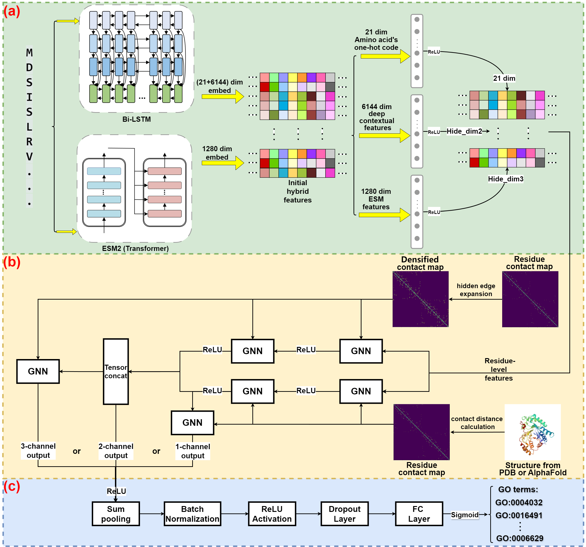

# MCCPFP：A protein function prediction method based on Multi-Level Protein Sequence and Structural Features

This repository contains the experimental source code for TransGO, as discussed in the paper "**Predicting Protein Function by Integrating Multi-Level Protein Sequence and Structural Features through a Document-Based Database**" along with the data scraping and splitting scripts used in the process.

## 1. Dependencies

- python == 3.10
- CUDA == 11.8
- cudnn == 8.8
- torch == 2.3.1
- torch-geometric == 2.6.1
- jsonpath == 0.82
- pymongo == 3.12.1

## 2. Dataset Preprocessing

### 2.1 ProGO Database

We obtained the experimental dataset required for our study from the document-based protein association database, ProGO. For details on the database construction and data retrieval process, please refer to: [sitanli2/ProGO_Database: Construction and overall framework of the ProGO Database](https://github.com/sitanli2/ProGO_Database)

- The **Uniprot_Scrapy**, **PDB_Scrapy**, and **Chembl_Scrapy** folders under **ProGO_scrapy/** are used to retrieve protein association data from the open data APIs of Uniprot, PDB, AlphaFold, and Chembl databases. These scripts also perform data cleaning on the returned JSON and XML documents.
- The **ProGO_scrapy/MySQL_chembl** script is used to convert the ChEMBL32 MySQL database into JSON dictionaries that can be stored in MongoDB.

### 2.2 Experimental Dataset PreProcessing

To predict protein functions by integrating sequence and structural data, we developed a comprehensive workflow based on ProGO database. Users can selected protein entries from ProGO (47,789 entries) based on specific criteria.

- The **Preprocessing/PDBID_mapping_UPID.py** script is used to map the PDBID of a specified protein chain to its corresponding ID in the Uniprot database.
- The **Preprocessing/CollectFromProGO.py** script is used to filter and retrieve the corresponding protein data from ProGO based on user-provided criteria, including the complete sequence, structural files, and functional details.
- The **Preprocessing/CollectFromDisk.py** script is used to refine the DeepFRI and PDB-B datasets that are directly downloaded to the local machine.

The final dataset will be stored in the **UltraDataset** folder. The **filteredIDlist.txt** file contains the entry IDs selected from ProGO, such as **"1UMK$A=27-301$P00387"**. In this ID format:

**1UMK** represents the PDB ID.

**$A=27-301** indicates the specific chain (A) and the residue range (27-301).

**$P00387** corresponds to the UniProt ID.

### 2.3 **Multi-level** Modeling of Protein Structures

We compute residue contact maps with varying connection densities by calculating the distance between atoms (specifically Cα atoms) and employing a unique hidden edge expansion method. This approach captures contact relationships, encompassing both explicit and implicit interactions.

- The **biotoolbox/ContactMapGen.py/contact_mapping_PDB()** function is used to extract the corresponding contact map of a protein chain from an experimentally determined PDB file, based on different contact threshold values.
- The **biotoolbox/ContactMapGen.py/contact_mapping_AlphaFold()** function is used to extract the corresponding contact map of a protein chain from an AlphaFold-predicted structure file, based on different contact threshold values.
- The **biotoolbox/ContactMapGen.py/ContactMap_densities_Switching()** function is used to identify hidden edges with strong correlations or redundant edges with weak correlations in the contact map.
- The **biotoolbox/ContactMapGen.py/insert_hidden_edge()** function is used to expand the corresponding contact map by inserting hidden edges.
- The **biotoolbox/ContactMap_visualization.py** script is used for the visualization of protein contact maps.
- The **biotoolbox/AlphaFoldfile_Dataset_Ultimate.zip** and **PDBfile_Dataset_Ultimate.zip** contain the initial PDB structure files retrieved from ProGO.
- The **biotoolbox/Contactmapfile_Dataset_Ultimate.zip** contains protein contact maps with varying contact densities that have been extracted.
- The script **biotoolbox/Alpha_seq_mapping_update.py** is used to generate protein IDs along with their corresponding protein chain sequences, or sequence fragments.

## 3. Training and validation

We conduct a series of controlled and ablation experiments to evaluate the performance of the TransGO model alongside other comparative models, while also investigating strategies to reduce training costs.

- **TransGO_refine/DeepFRI_main.py** and **ESM_main.py**: These scripts replicate the DeepFRI and DeepFRI(ESM2) model based on the works of MaW et al.([Wenjian-Ma/Struct2Go](https://github.com/Wenjian-Ma/Struct2Go)) and Gligorijević V et al.([flatironinstitute/DeepFRI: Deep functional residue identification](https://github.com/flatironinstitute/DeepFRI))

- **ESM_extract** and **TransGO_refine/utils/ESM_bilstm_Dataset()**: These functions combine two advanced protein language models—the model introduced by Belpler et al. ([tbepler/prose: Multi-task and masked language model-based protein sequence embedding models.](https://github.com/tbepler/prose?tab=readme-ov-file)), based on Bi-LSTM, and the Evolutionary Scale Modeling (ESM) model ([facebookresearch/esm: Evolutionary Scale Modeling (esm): Pretrained language models for proteins](https://github.com/facebookresearch/esm?tab=readme-ov-file#available-models)), which is based on Transformer. Together, they form a hybrid feature extractor.

- **TransGO_refine/model.py** integrates various graph neural network feature propagation algorithms, such as GCN, GAT, GATv2, and SAGEConv, among others.

- **TransGO_refine/model.py** integrates multiple graph neural network architectures, including MCC-GNN: a multi-channel Graph Neural Network that combines sequence representations and contact maps with varying contact densities. The network features three configurations—single, dual, and triple channels—each providing a distinct approach to capturing and combining different aspects of protein data.

- **TransGO_refine/Naive.py** calculates the frequencies of GO terms in the training set and assigns these frequencies as predictions across all proteins.

- **TransGO_refine/TransGO_main.py** trains and validates the TransGO model along with other comparative models. During the dual-channel MCC-GNN training process, we can switch between different contact map inputs for each channel.

  

